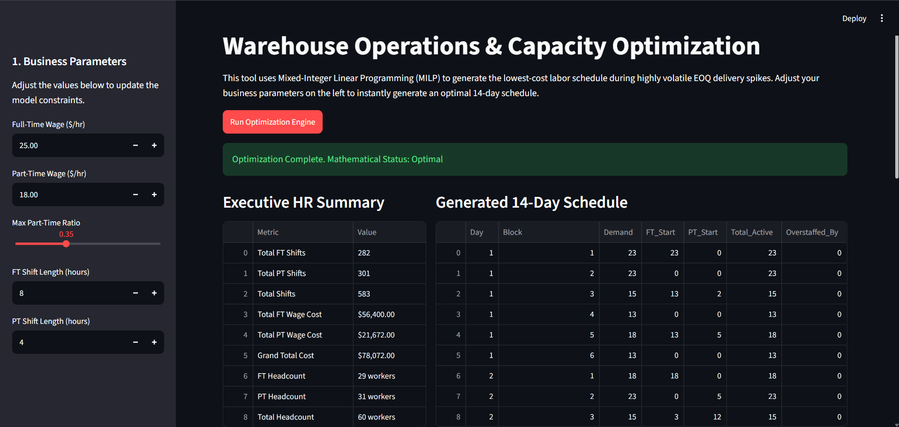
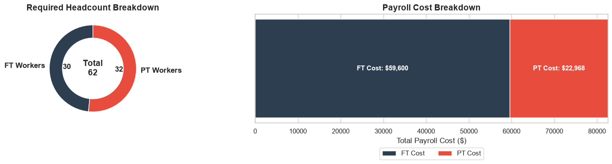
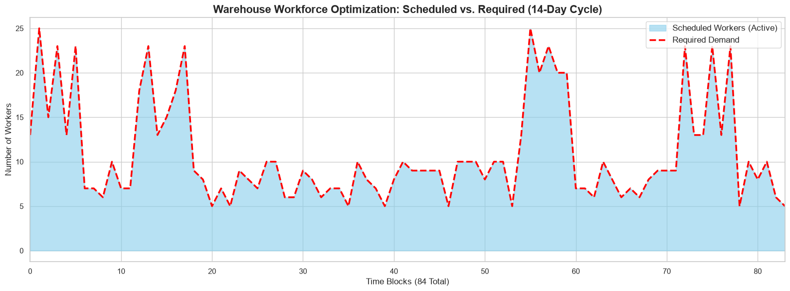

# Operations Labor Capacity Optimization (LP)

An end-to-end Operations Research and Capacity Planning pipeline that uses Mixed-Integer Linear Programming (MILP) to generate an optimal, cost-efficient labor schedule. 

This project simulates a highly volatile logistics environment where bulk inventory deliveries cause massive spikes in labor demand. The optimization engine calculates the exact number of Full-Time and Part-Time shifts required to cover demand without violating corporate HR stability policies.

This repository features a "dual-threat" implementation:
1. **The Backend Pipeline (Jupyter/Colab):** A programmatic data pipeline that ingests raw business rules via Excel, runs the PuLP optimization engine, and outputs a mathematically perfect labor schedule.
2. **The Frontend Web App (Streamlit):** A polished, interactive SaaS dashboard allowing non-technical operations managers to adjust wage rates and HR constraints via UI sliders to instantly generate new schedules.

## Interactive Streamlit Web App
The optimization engine is deployed as an interactive web application. Stakeholders can adjust business parameters (like part-time caps and hourly wages) on the fly, visualizing the financial breakdown and downloading the final schedule without touching code.

**

## The Operational Problem
Warehouses utilizing Economic Order Quantity (EOQ) inventory models often face severe capacity planning challenges. Instead of a steady flow of daily trucks, they receive massive bulk shipments on random days, causing labor demand to spike by up to 250%. 

Relying entirely on Full-Time (FT) staff leads to expensive overstaffing on quiet days. Relying entirely on Part-Time (PT) staff violates operational stability and union policies. 

**The objective:** Minimize total payroll costs while guaranteeing 100% of the required labor demand is met, ensuring that PT labor never exceeds 35% of total scheduled hours.

## The Mathematical Engine (Linear Programming)
This model operates at the **Capacity Planning (Shift Generation)** level. It determines the optimal aggregate pool of 8-hour and 4-hour time blocks needed. 

The engine uses the `PuLP` library to solve the following constraints:

**Decision Variables:**
* $F_t$ = Number of FT shifts (8-hour) starting at time block $t$.
* $P_t$ = Number of PT shifts (4-hour) starting at time block $t$.
* $D_t$ = Required staff demand for time block $t$.

**Objective (Minimize Total Wages):**

$$ \min \sum_{t=1}^{84} (200 F_t + 72 P_t) $$

**Constraints:**
1. **Demand Satisfaction:** Active workers (FT starting now + FT continuing from last block + PT starting now) must meet or exceed required demand.

$$ F_t + F_{t-1} + P_t \ge D_t \quad \forall t $$

2. **Operational Part-Time Cap:** Part-time hours cannot exceed 35% of total hours worked.

$$ \sum_{t=1}^{84} 4 P_t \le 0.35 \left( \sum_{t=1}^{84} (8 F_t + 4 P_t) \right) $$

## Visual Analytics & Automated Excel Dashboard
The final stage of the pipeline automatically translates the raw mathematical outputs into a formatted, multi-sheet Excel dashboard using `Pandas` and `OpenPyXL`. **The generated `Optimized_Warehouse_Schedule.xlsx` file is available in this repository.** 

The pipeline seamlessly embeds the following `Matplotlib` and `Seaborn` data visualizations directly into the stakeholder reports:

**

**

## Tech Stack
* **Python** (Core Logic)
* **Streamlit** (Frontend Web Framework)
* **PuLP** (Mixed-Integer Linear Programming Engine)
* **Pandas & NumPy** (Data Manipulation)
* **Matplotlib & Seaborn** (Data Visualization)
* **OpenPyXL** (Automated Excel Formatting & Image Embedding)

## How to Run Locally
1. Clone the repository.
2. Install dependencies: `pip install -r requirements.txt`
3. Launch the web app: `streamlit run app.py`
